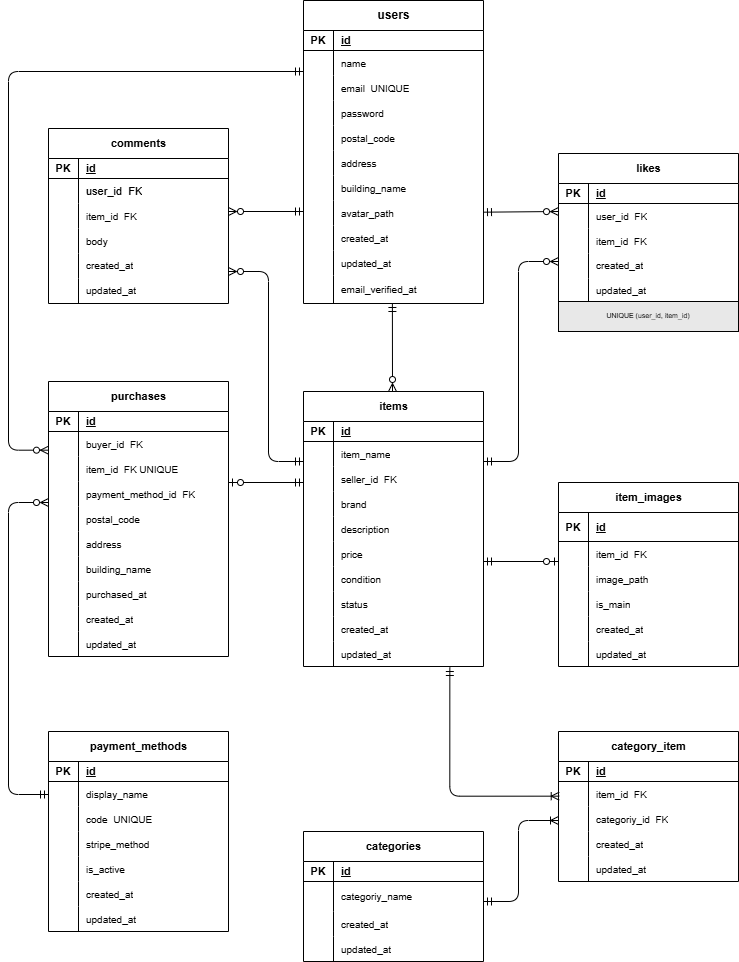

# 模擬案件１（フリマアプリ）

## 概要
Laravelを用いたフリマアプリケーションです。
ログイン機能・商品出品・購入・いいね・コメント等の機能を実装しています。

---

## 環境構築

### 1. リポジトリのクローン
```Bash
git@github.com:akari44/furima-app.git
cd furima-app
```

### 2.DockerDesktop の起動
Docker Desktop アプリを起動してください。

### 3.Docker ビルド・起動
```Bash
docker-compose up -d --build
```
※※ Mac の M1/M2 チップ環境で 
```
no matching manifest for linux/arm64/v8
```
が出る場合は、
docker-compose.yml の mysql に以下を追加してください。
```YAML
mysql:
  platform: linux/x86_64
```
### 4.Laravel 環境構築
```Bash
docker-compose exec php bash composer install
```
### 5..env ファイルの作成
```Bash
cp .env.example .env
```
.env ファイルは、Docker環境に合わせた設定がすでに反映されています。
必要に応じて環境変数を変更してください。

### 6.Stripeの設定（決済機能を使用する場合）
Stripeを利用する場合は、.env に以下の環境変数を設定してください。
```env
STRIPE_KEY=あなたの公開キー
STRIPE_SECRET=あなたのシークレットキー
```

### 7.アプリケーションキーの生成
```Bash
php artisan key:generate
```
### 8.マイグレーションの実行
```Bash
php artisan migrate
```

### 9.シーディングの実行(サンプルデータ作成)
```Bash
php artisan db:seed
```
### 10a.ストレージのシンボリックリンク作成（画像表示に必要）
```Bash
php artisan storage:link
```
---
## 動作確認
### アプリケーション
以下にアクセスしてください。

- http://localhost

### phpMyAdmin
- http://localhost:8080

---

## テストユーザー

以下のユーザーでログイン可能です。

テストユーザー１
- メールアドレス：akari@gmail.com  
- パスワード：akariakari  

テストユーザー２
- メールアドレス：coachtech@gmail.com  
- パスワード：coachtech

※ 上記はシーディングで作成されています。

------
## テスト実行

### PHPUnit 実行
```bash
php artisan test
```

### 特定テストのみ実行
```bash
php artisan test --filter=ItemTest
```

---
## 主な機能

- ユーザー登録 / ログイン
- 商品一覧表示
- 商品詳細表示
- 商品出品
- 商品購入
- いいね機能
- コメント機能
- 商品検索機能

---
## 使用技術（実行環境）
- PHP 8.1.33
- Laravel 10.49
- MySQL 8.0.26
- Nginx 1.21.1
- phpMyAdmin
- Docker Desktop 28.3.2
- Docker Compose 2.38.2
- GitHub
---
## ER図


---

## システム要件（抜粋）
- データベース：MySQL
- 運用・保守：クライアントが実施
- リリース：4ヶ月後を予定
- セキュリティ：アプリケーション内に限り考慮
- SEO：考慮しない
- コード品質：コーディング規約に準拠
- 開発環境：開発者がローカル環境（Docker）を用意
- サーバー設置 / ドメイン取得 / SSL：いずれも考慮しない